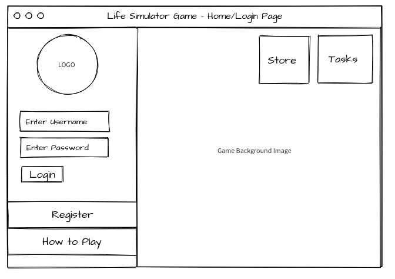

# TGC PROJECT TWO: LIFE SIMULATOR GAME

## Introduction

Life Simulator Game is a clicker-based game that was initiated for an assignment during my duration of studies under Trent Global College, where we were required to create an interactive web application using a reactive framework (such as Vue or React) and our own RESTful API using Mongo and Express.
The motivation behind the game comes from my own journey towards adulthood, where I witnessed people around me, including myself, struggling to find a balance between being genuinely happy and working a 8-6 job to earn a decent living, which leads to the purpose of the game - as stated in the title - Life Simulator Game, is to mimick the difficulties of managing the act of balance in the different aspects (such as happiness, health, energy and money) in one's life. 
It also aims to challenge a player's multi-tasking skill and create an understanding about how difficult it can be to create a balance in life. 

## Demo

Click [here](link) to play the game now!

The source code for the project's api can also be found [here](https://github.com/elainehowyl/tgc-projecttwo-life-simulator-api)

## UI/UX

### Strategy

The objective of this site is to provide players a casual and at the same time, relatable clicker game which can be played during their free time or even when they are feeling stressed.
The game can also be targeted at audiences who are a fan of casual and clicker games in general.

### Users' Stories

1. As a Site Owner...
* I want to create a game where the player can have fun while at the same time, learn something from it.
* I want to create a game where the player can register for an account so that they can save their game progress.
* I want to create a game where the player can easily navigate around without many clicks.

2. As a User/Player...
* I want to be able to know what the game is about before creating an account for it.
* I want to have a casual game that I can have fun with during my leisure time.
* I want to be able to save my game progress so that I can still revisit the game after some times.

### Structure & Skeleton

The structure of the game page is designed in a way such that it is simple to navigate around, and that every function (such as login) can be executed in a single page.
The page is separated into two sections: 
1. A side bar - displays logo, login form, user stats and buttons.
2. A game display screen - displays character's sprite, game buttons and functions.

There is also a wide usage of Modals from Bootstrap, which acts like a pop-up box to display 'Register An Account' form and 'How to Play' page such that no re-routing would be required.

Below shows the structure of the two different pages:

* Home Page (Before the player login):

* Game Page (After the player login):

### Color and Fonts

I picked purple to be the background color of the side bar because it gives off a joyous and fun tone, but at the same time, not too bright of a color that will hurt one's eyes.
For the font, 'Chewy, cursive' was chosen as it emits a child-like, comic-like vibe and also, at the same time, not too fanciful that it is hard to read, making it an ideal choice for a casual game environemnt. 

## Features

### Functional Features

1. Login Form / Register Form: 
Allow existing users to login to their accounts and also allowing new user to register for an account.
2. Save Button: 
Allows user to save and load their game progress.
3. Delete Account Button: 
Allows user to delete their account after entering the correct password.
4. Sign Out Button: 
Allow user to sign out of the game.
5. Store/Task Button(in the game): 
Will perform an increment or decrement on users' stats based on the tasks that they've clicked onto.

### Content Features

1. 'How to play' Modal: 
Allows user to understand the logic of the game before playing.
2. User Stats:
A set of user's stats will be displayed in the side bar so that user can see the status of their stats after they performed certain tasks.

## Features